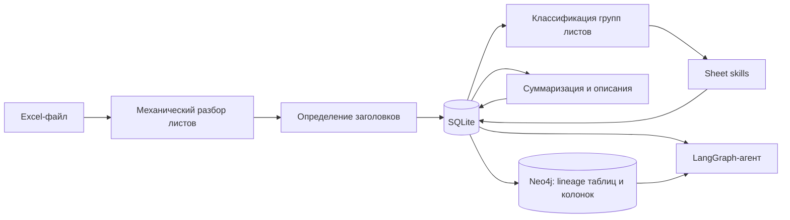
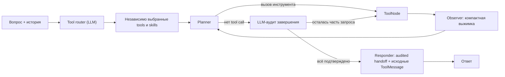

# ETL S2T Parser

[](https://www.python.org/)
[](https://flask.palletsprojects.com/)
[](LICENSE)

ETL S2T Parser — веб-приложение для разбора Excel-файлов с Source-to-Target-маппингами, описаниями таблиц и правилами преобразований.

Приложение:

- определяет заголовки и читает многоуровневые Excel-листы;
- сохраняет структуру файла и значения строк в SQLite;
- классифицирует листы и извлекает S2T-трансформации по настраиваемым схемам;
- строит краткое бизнес-описание загруженного файла;
- создаёт локальные эмбеддинги описаний файлов и таблиц;
- проецирует связи между таблицами и колонками в Neo4j;
- отвечает на вопросы через инструментального LangGraph-агента.

## Как устроена обработка



### 1. Разбор Excel

`processing/excel.py` один раз читает каждый лист, применяет найденное или исправленное пользователем решение о заголовке, разворачивает объединённые ячейки заголовков и строит плоские имена колонок. Скрытые строки по умолчанию не загружаются; в интерфейсе их можно явно включить.

Строку заголовка среди первых 10 строк выбирает `agents/header_classifier.py` переданной CatBoost-моделью по 22 признакам строки. Эвристики выбора заголовка не используются; LLM вызывается только при ошибке загрузки или выполнения CatBoost.

### 2. Хранение исходных фактов

SQLite — основной источник данных приложения. В неё записываются:

- метаданные файла;
- листы и распознанные заголовки;
- значения ячеек с исходными номерами строк;
- каталоги source- и target-таблиц;
- строки S2T-трансформаций.

Одинаковые строки не дедуплицируются: каждая строка исходного Excel остаётся отдельным фактом.

### 3. Классификация листов и sheet skills

Сначала `agents/sheet_group_classifier.py` определяет группу каждого листа:

1. точное или нечёткое совпадение по `config/sheet_groups.json`;
2. один LLM-вызов только для несопоставленных листов;
3. сохранение подтверждённых новых алиасов в конфигурацию.

После классификации запускается подходящий обработчик из `sheet_skills/`:

- `sheet_skills/s2t.py` сопоставляет колонки и строит строки `s2t_transformations`;
- `sheet_skills/additional_objects.py` разбирает SQL дополнительных объектов
  через SQLGlot и добавляет в общую ETL-таблицу lineage каждого логического
  scope: CTE, подзапроса, ветви SELECT и set-операции; промежуточные имена
  локальны для объекта, а дерево `Scope.union_scopes` сохраняется без
  дополнительной нормализации;
- `sheet_skills/table_catalog.py` сохраняет названия и описания source/target-таблиц.

Для S2T сначала используется сопоставление по `config/column_mapping.json`. Если найдены не все настроенные поля, модель получает один компактный запрос для этого листа. Если валидный план не получен, обработка завершается ошибкой без молчаливой записи неполных данных.

Отсутствие `target_table` в любой извлекаемой строке считается ошибкой до начала транзакции. Уже сохранённые трансформации при этом не изменяются.

### 4. Суммаризация и эмбеддинги

`agents/summarizer_agent.py` делает один LLM-вызов: детерминированно извлекает описания таблиц, представлений, атрибутов и полей из всех сохранённых листов с данными и получает сразу бизнес-саммари и краткое описание.

При сохранении описаний создаются локальные эмбеддинги:

- `files.description`;
- `source_tables.description`;
- `target_tables.description`.

Модель задаётся переменной `EMBEDDING_MODEL`. Векторы хранятся в BLOB-полях соответствующих SQLite-таблиц, отдельная таблица эмбеддингов не используется.

### 5. Графовая проекция

После успешной записи S2T-результата `services/graph_sync.py` может пересобрать в Neo4j проекцию lineage выбранного файла:

- узлы `ETLColumn` представляют колонки логических таблиц;
- связи `TRANSFORMS_TO` представляют переход source-колонки в target-колонку.
- узлы `ETLTable` представляют логические source/target-таблицы;
- каждая связь `TABLE_TRANSFORMS_TO` соответствует строке трансформации и хранит полный `sql_query` из `s2t_transformations.transformation_rule`.

Названия файлов, листов, описания и сами строки трансформаций остаются в SQLite. Отсутствие узла или связи в Neo4j не доказывает отсутствие факта в SQLite.

### 6. Инструментальный агент

Перед запуском основного графа отдельный tool-router делает один обычный LLM-вызов.
Он получает текущий вопрос, последние сообщения истории и компактный каталог имён с
описаниями доступных инструментов, после чего возвращает в сыром тексте минимальный
JSON `{"tools": [...], "skills": [...]}`. JSON отдельно разбирается и строго
проверяется приложением. Только выбранные tools передаются planner. Skills выбираются
тем же router независимо по смыслу запроса и затем загружаются по указанным именам.
Если модель не вернула валидный маршрут, запрос завершается явной ошибкой;
эвристического fallback и расширения выбора до групп инструментов нет.

Полный `skills.md` при импорте chat-agent не загружается. После маршрутизации в
системный prompt добавляются только явно выбранные router секции; повторяющиеся
имена объединяются.

После прямого выбора tools `agents/chat_graph.py` реализует цикл:



Сырой результат каждого tool видят observer, следующий planner и responder. Planner
получает оригинальные `AIMessage.tool_calls` и `ToolMessage`, чтобы использовать
точные значения первого шага в аргументах следующего tool, а также текстовые
observations. Когда новых tools не требуется, planner объединяет проверенные
факты в handoff. Перед завершением отдельный обычный LLM-аудит сверяет исходный
запрос со списком фактически завершённых ToolMessage; если часть задачи не
подтверждена, аудит может вернуть следующий native tool call. Responder получает
пользовательский диалог, audited handoff и исходные
`ToolMessage`, поэтому может без сокращений перенести запрошенные строки и значения.
Внутренние observations responder-у не передаются. Постфактум-фильтрации и
`skipped_duplicate` в графе нет.

Маршрутизация источников разделена:

- строки, маппинги, правила и таблица трансформаций читаются из SQLite;
- lineage, пути, upstream/downstream и impact analysis читаются из Neo4j;
- отсутствие данных в Neo4j не подменяет проверку SQLite.

Для анализа полного пути преобразования агент сопоставляет правила из
`s2t_transformations` с SQL из `additional_objects.sql`. `NULL`, пустое значение
или ровно `-` трактуется как прямой переход source → target. Полные SQL-запросы
разбираются через SQLGlot на уровне колонок или таблиц; описательный текст не
выдаётся за SQL-lineage. Neo4j при этом используется только как проекция
топологии, а исходные правила подтверждаются по SQLite.

Диалог read-only по умолчанию. Инструменты изменения данных находятся в отдельном registry и не выдаются обычному чату.

## Структура проекта

```text
app.py                         Flask API и запуск приложения
processing/excel.py            механический разбор Excel
storage/database.py            схема и базовые операции SQLite
storage/s2t.py                 запись, чтение и поиск S2T
graph_storage/                 конфигурация, подключение и чтение Neo4j
services/analysis.py           запуск анализа после сохранения файла
services/embeddings.py         локальное эмбеддирование описаний
services/graph_sync.py         проекция SQLite → Neo4j
agents/agent.py                определение заголовков и вход в чат
agents/header_classifier.py    признаки и прогноз CatBoost для строки заголовка
agents/tools/routing.py        LLM-router точных имён tools со строгой валидацией
agents/chat_graph.py           LangGraph planner/tools/observer/responder
agents/summarizer_agent.py     однопроходная суммаризация
agents/sheet_group_classifier.py
agents/tools/                  тематические @tool и registry
agents/prompts/                системные инструкции агента
sheet_skills/s2t.py            извлечение S2T
sheet_skills/table_catalog.py  каталоги source/target-таблиц
config/                        JSON-схемы и их загрузчики
templates/                     веб-интерфейс
tests/                         автоматические проверки
samples/                       примеры Excel-файлов
models/                        локальные модели приложения
```

## Быстрый запуск

### Требования

- Python 3.12 или новее;
- [uv](https://docs.astral.sh/uv/);
- доступ хотя бы к одному LLM-provider: GigaChat, OpenRouter или Ollama;
- Neo4j — только если нужна графовая проекция и lineage-запросы.

### Установка

```bash
git clone https://github.com/Xpehutta/ETL-S2T-Parser.git
cd ETL-S2T-Parser
uv sync --no-dev
```

Для разработки и запуска тестов установите также dev-группу: `uv sync`.

Создайте `.env` в корне проекта, затем запустите:

```bash
uv run python app.py
```

Основной интерфейс откроется по адресу `http://127.0.0.1:5000`, чат — по адресу `http://127.0.0.1:5000/chat_app`.

Runtime-логи одновременно выводятся в консоль и записываются в UTF-8 файл
`logs/agent.log` с ротацией. В нём сохраняются выбранные tools, решения
planner, аргументы tool calls, краткий preview результатов и observations.
Pytest использует отдельный временный log-файл, поэтому тестовые `ping`, `echo` и
другие заглушки в runtime-лог не попадают.

Настройки:

```ini
LOG_LEVEL=INFO
LOG_FILE=logs/agent.log
LOG_MAX_BYTES=5242880
LOG_BACKUP_COUNT=5
```

Относительный `LOG_FILE` считается от корня проекта. После достижения лимита создаются
архивы `agent.log.1`, `agent.log.2` и далее.

CatBoost-модель заголовков уже находится в `models/catboost_header_model.cbm`. Для другого расположения задайте:

```ini
CATBOOST_HEADER_MODEL_PATH=models/catboost_header_model.cbm
```

## Настройка LLM

По умолчанию приложение использует **GigaChat** (`LLM_PROVIDER=gigachat`). Для другого backend задайте `LLM_PROVIDER`.

### GigaChat (по умолчанию)

```ini
LLM_PROVIDER=gigachat
GIGACHAT_API_KEY=your_key
GIGACHAT_MODEL=GigaChat
GIGACHAT_API_URL=https://gigachat.devices.sberbank.ru/api/v1
GIGACHAT_SCOPE=GIGACHAT_API_PERS
GIGACHAT_VERIFY_SSL=false
GIGACHAT_TIMEOUT=120

GIGACHAT_HEADER_TIMEOUT=20
GIGACHAT_HEADER_RETRY_ATTEMPTS=1
GIGACHAT_HEADER_PREVIEW_ROWS=4
```

Вместо `GIGACHAT_API_KEY` также поддерживаются `GIGACHAT_CREDENTIALS` и `GIGACHAT_EMBEDDINGS_CREDENTIALS`. Переменная `MODEL` используется как fallback для `GIGACHAT_MODEL`.

### Ollama

Используемая модель должна поддерживать native tool calling, иначе чат-агент не сможет вызывать инструменты.

```bash
ollama pull qwen2.5:7b
```

```ini
LLM_PROVIDER=ollama
OLLAMA_MODEL=qwen2.5:7b
OLLAMA_BASE_URL=http://localhost:11434
OLLAMA_NUM_CTX=16384
OLLAMA_TIMEOUT=120
OLLAMA_TEMPERATURE=0
OLLAMA_REASONING=false
```

### OpenRouter

```ini
LLM_PROVIDER=openrouter
OPENROUTER_API_KEY=sk-or-v1-...
OPENROUTER_MODEL=openrouter/free
OPENROUTER_BASE_URL=https://openrouter.ai/api/v1
OPENROUTER_TIMEOUT=120
OPENROUTER_TEMPERATURE=0
```

## Настройка эмбеддингов

Эмбеддинги считаются локально через Sentence Transformers. Например:

```ini
EMBEDDING_MODEL=intfloat/multilingual-e5-small
```

При первом использовании библиотека загрузит модель в локальный кеш.

## Настройка Neo4j

Neo4j запускается отдельным процессом и не обязан находиться внутри Flask-приложения. Пример запуска через Docker:

```bash
docker run --name etl-s2t-neo4j \
  -p 7474:7474 \
  -p 7687:7687 \
  -e NEO4J_AUTH=neo4j/change_me \
  -d neo4j:5
```

Добавьте подключение в `.env`:

```ini
NEO4J_URI=neo4j://localhost:7687
NEO4J_USERNAME=neo4j
NEO4J_PASSWORD=change_me
NEO4J_DATABASE=neo4j
```

Веб-интерфейс Neo4j Browser будет доступен по адресу `http://localhost:7474`.

Если Neo4j не настроен или недоступен, SQLite-анализ остаётся сохранённым, а ошибка синхронизации возвращается отдельно.

## Конфигурация извлечения

Логика извлечения задаётся данными, а не зашивается в обработчик:

| Файл | Назначение |
|---|---|
| `config/sheet_groups.json` | группы листов и допустимые имена/алиасы |
| `config/column_mapping.json` | поля группы и варианты заголовков Excel |
| `config/usefull_col_extraction.json` | целевые SQLite-таблицы, группа листа и список записываемых полей |
| `config/table_layers.json` | переходы source/target ETL-слоёв по семантическим группам листов |

Пример целевого описания:

```json
{
  "s2t_transformations": {
    "sheet_group": "s2t",
    "fields": [
      "target_field",
      "source_field",
      "target_table",
      "source_table",
      "transformation_rule"
    ]
  }
}
```

Имена полей в `fields` одновременно определяют ожидаемые роли из `column_mapping.json` и пользовательские колонки целевой SQLite-таблицы.

`source_layer` и `target_layer` не являются LLM-ролями Excel. Приложение
вычисляет их по семантической группе исходного листа с помощью
`table_layers.json`. Для листов группы `s2t` сейчас задан переход `B -> T`,
для промежуточных scope `additional_objects` слои неизвестны (`NULL -> NULL`),
а только вход в конечную таблицу объекта получает `NULL -> B`;
имена таблиц при этом не анализируются. Для листа без настроенного перехода
записывается `NULL`.

## SQLite-схема

По умолчанию база создаётся в `excel_data.db`.

| Таблица | Содержимое |
|---|---|
| `files` | файл, модель, время загрузки, summary, description и embedding |
| `file_sheet_headers` | лист, решение о заголовке и плоские имена колонок |
| `data` | значения ячеек: лист, исходная строка, колонка и значение |
| `source_tables` | строки каталога таблиц-источников и embeddings описаний |
| `target_tables` | строки каталога таблиц-приёмников и embeddings описаний |
| `additional_objects` | дополнительные объекты: `name` и `sql` |
| `pxf_to_a` | имена внешней, материализованной и репличной A-таблиц и СОД |
| `s2t_transformations` | общие колонковые ETL-связи из S2T и SQL дополнительных объектов, nullable source/target-слои и правила |

Полная очистка хранилища не ограничивается удалением строк: SQLite-таблицы
пересоздаются по актуальной схеме приложения, после чего очищается состояние
текущего анализа. Поэтому устаревшие колонки не сохраняются после сброса.

При несовместимой старой схеме приложение выдаёт явную ошибку. Автоматическая миграция пользовательских данных не выполняется.

Для явного обновления базы предыдущей версии, в которой ещё нет ETL-слоёв,
однократно выполните:

```bash
uv run python -c "from storage.database import migrate_s2t_layer_columns; from storage.s2t import backfill_s2t_layers; print(migrate_s2t_layer_columns()); print(backfill_s2t_layers())"
```

## Инструменты агента

Основные read-only инструменты:

- `run_sql` — свободный read-only SQL по публичной SQLite-схеме;
- `parse_sql_column_lineage` — колонковый lineage переданного SQL через SQLGlot;
- `parse_sql_table_lineage` — табличный lineage переданного SQL через SQLGlot;
- `trace_transformation_path` — составной путь по S2T, SQLGlot, additional objects и Neo4j;
- `visualize_transformation_path` — текстовая и Mermaid-визуализация найденного S2T-пути;
- `search_excel_values` и `get_excel_row` — поиск исходных значений и восстановление строки листа;
- `semantic_search_descriptions` — смысловой поиск по embeddings описаний;
- `list_s2t_transformations` и `search_s2t_transformations` — просмотр S2T;
- `list_s2t_table_names` — детерминированные списки source/target, пересечение, объединение и разности ролей;
- `summarize_s2t_tables` — агрегированная сводка по source- или target-таблицам;
- `list_files`, `resolve_file`, `list_sheets`, `list_columns` — навигация по загрузкам;
- `run_cypher` — свободный read-only Cypher;
- `trace_neo4j_lineage` — upstream/downstream-связи колонок;
- `trace_neo4j_table_lineage` — upstream/downstream-связи таблиц: сгруппированные connections со счётчиками и исходные рёбра вместе с SQL;
- `show_plan` — явная фиксация выполненных и следующих действий.

Инструменты объявлены через `@tool(parse_docstring=True)` в `agents/tools/` и явно включаются в `agents/tools/registry.py`.

## HTTP API

| Метод | Путь | Назначение |
|---|---|---|
| `GET` | `/` | основной веб-интерфейс |
| `GET` | `/chat_app` | интерфейс чата |
| `GET` | `/analysis_progress/<upload_id>` | прогресс фонового анализа |
| `POST` | `/upload` | загрузка и первичный разбор Excel |
| `GET` | `/summary/<file_id>` | summary файла |
| `GET` | `/description/<file_id>` | описание файла |
| `GET` | `/transformations/<file_id>` | строки S2T |
| `DELETE` | `/transformations/<file_id>` | удаление S2T указанного файла |
| `DELETE` | `/storage` | полная очистка SQLite, Neo4j и runtime-кеша |
| `GET` | `/sheet_groups/<file_id>/classify` | классификация листов |
| `GET` | `/exports/sql/<filename>` | выгрузка подготовленного SQL-файла |
| `POST` | `/chat` | запрос к инструментальному агенту |

История чата хранится в `sessionStorage` браузера, поэтому переживает перезагрузку страницы в той же вкладке, но не записывается в SQLite.

## Langfuse

Интеграция вынесена в `agents/observability.py` и остаётся необязательной. При заданных ключах Langfuse получает трассировки поддерживаемых LLM-вызовов; без конфигурации основная обработка продолжает работать.

```ini
LANGFUSE_PUBLIC_KEY=pk-lf-...
LANGFUSE_SECRET_KEY=sk-lf-...
LANGFUSE_TRACING_ENVIRONMENT=development
```

## Разработка

```bash
pytest tests/ -q
pytest tests/ --cov=. --cov-config=.coveragerc
```

Перед изменением схемы SQLite, формата конфигураций или набора tools обновляйте соответствующие проверки в `tests/`.
