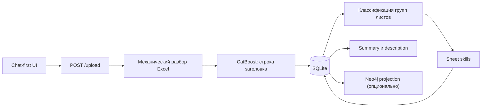
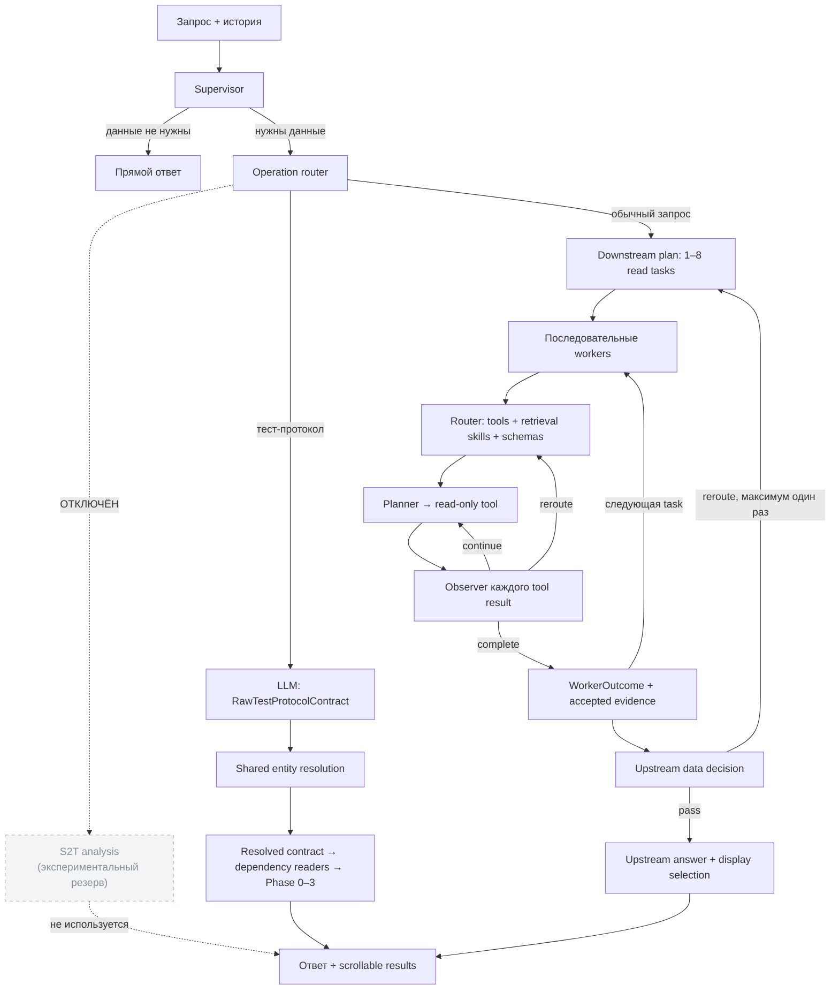

# ETL S2T Agent

[](https://www.python.org/)
[](https://flask.palletsprojects.com/)
[](https://www.langchain.com/langgraph)

ETL S2T Agent — chat-first приложение для загрузки и анализа Excel-файлов с Source-to-Target-маппингами. Оно сохраняет исходные факты в SQLite, извлекает S2T- и SQL-lineage, при наличии Neo4j строит графовую проекцию и отвечает на вопросы через многоагентный LangGraph.

> **Baseline качества:** [live-отчёт от 3 сентября 2026 года](LIVE_AGENT_STATUS_REPORT_2026-09-03.md). Он фиксирует последнюю сохранённую семантическую оценку, состояние загрузки и причины оставшихся провалов; текущий состав тестов описан ниже.

> **Последний независимый holdout:** [A/B-отчёт от 9 сентября 2026 года](LIVE_MULTIAGENT_HOLDOUT_REPORT_2026-09-09.md). Он фиксирует отрицательный результат сравнения двух multiagent-конфигураций на GigaChat-2-Max; candidate не принят.

Исторические демонстрации и отчёты предыдущих прогонов собраны в
[`docs/history/`](docs/history/README.md) и не описывают текущее поведение.

## Возможности

- загрузка `.xlsx`, `.xls` и `.xlsm` из единого интерфейса чата;
- автоматический выбор строки заголовка CatBoost-моделью;
- сохранение заголовков и значений Excel без обрезки в SQLite;
- классификация листов и настраиваемое сопоставление колонок;
- извлечение S2T, каталогов таблиц, PXF-маппингов и дополнительных объектов;
- разбор SQL дополнительных объектов через SQLGlot;
- read-only вопросы к SQLite и Neo4j на естественном языке;
- полные табличные результаты в отдельном scrollable-блоке, а не в тексте чата;
- сравнение многоагентного режима с базовым одноагентным режимом;
- метрики времени, LLM-вызовов, инструментов и токенов для live-сценариев.

## Архитектура

SQLite является источником исходных фактов. Neo4j хранит только производную проекцию lineage и может быть отключён.

### Загрузка Excel



`processing/excel.py` читает каждый лист один раз, сохраняет исходные номера строк, разворачивает объединённые ячейки данных и по умолчанию исключает скрытые строки. Включить их можно при загрузке в интерфейсе. Ответ загрузки содержит `data_row_count` для каждого листа и `total_data_row_count` для всей книги; это число разобранных строк данных после фильтрации скрытых строк, независимо от числа заполненных ячеек, а одинаковые строки считаются отдельно.

Строка заголовка выбирается среди первых десяти строк моделью из `models/catboost_header_model.cbm`. Кандидаты с тремя и более пустыми/`Untitled` значениями исключаются, если остаются менее разреженные строки. При ошибке CatBoost используется настроенный LLM-provider.

После механического разбора:

1. лист сопоставляется с группой из `config/sheet_groups.json`;
2. колонки сначала сопоставляются детерминированно по `config/column_mapping.json`;
3. LLM вызывается только для листа с неполным сопоставлением;
4. результат валидируется и транзакционно записывается в целевую таблицу.

Одинаковые строки Excel не дедуплицируются. Если в непустой S2T-строке отсутствует `target_table`, запись завершается явной ошибкой до начала транзакции. Строки без единого S2T-значения не считаются бизнес-строками.

### Многоагентный чат

По умолчанию `CHAT_AGENT_MODE=multiagent`.



Основные контракты:

- supervisor отдельно формирует исполнимую `task` и устойчивый `context`;
- operation router один раз выбирает общий agentic-поток либо специализированный
  пайплайн и подключает только относящиеся к операции stage-skills;
- неявного «активного файла» нет: полный `filename` разрешается через
  `resolve_file`, а внутренний `file_id` берётся только из запроса или принятого
  результата разрешения; одна операция может ссылаться на несколько файлов;
- в общем потоке downstream сразу создаёт полный план из 1–8 задач чтения;
  workers выполняются последовательно и могут лениво прочитать принятые
  результаты предыдущих workers по коротким `result_id`;
- worker получает текущую задачу и короткие ссылки на доступные зависимости;
  router независимо выбирает tools, retrieval-skills и schemas, а planner
  вызывает только выбранные read-only tools;
- planner видит исходную задачу, последний обмен с инструментом и накопительную observer-выжимку;
- observer вызывается после каждого data-tool result и возвращает только
  `complete`, `continue` или `reroute`; невалидная структура повторно
  запрашивается на том же payload без повторного data-tool;
- полные результаты инструментов не копируются в историю worker: там остаётся ограниченный preview;
- upstream получает только `original_task` и принятые evidence: `evidence_id`, tool name, args, preview, `truncated` и булевый признак `displayable`; внутренний `display_ref`, worker summary, facts, limitations и runtime refs туда не передаются;
- принятые полные tool results сохраняются под run-scoped `result_id` и читаются через `read_previous_result` только когда краткого description недостаточно; табличные SQLite-результаты дополнительно материализуются во временной relation `result`, доступной через `query_saved_result`;
- если tool вернул только preview, схема сохранённого результата содержит `truncated=true`, поэтому его нельзя использовать как полный исходный набор;
- upstream сначала линейно вызывает `submit_upstream_data_decision`: обязательное поле `decision` равно `pass` или `reroute`, а `problem` служит необязательным пояснением. `reroute` запускает чистый повтор чтения со сбросом результатов прошлого цикла; `pass` переводит управление к отдельному `submit_upstream_answer`. Только этот второй вызов выполняет производный SQL/S2T-анализ по исходной task и evidence, формирует обязательный `answer` и опционально выбирает evidence IDs для UI. Отдельного semantic reviewer/repair нет;
- полные данные разрешаются по ссылкам только на границе HTTP-ответа.

Worker завершается самим planner только через native `finish_worker(summary)`. Обычный финальный текст отклоняется; полноту исходных данных определяет тот же structured observer.

Для повторяемых операций предусмотрены два специализированных маршрута:

- `s2t_analysis`: **ОТКЛЮЧЁН** — исключён из схемы operation-router и не может
  быть выбран в штатном запросе. Реализация сохранена только как
  экспериментальный резерв; обычные запросы анализа идут через общий
  agentic-поток и operation-skills;
- `validation_protocol`: LLM извлекает только пользовательский
  `RawTestProtocolContract`; общий resolver подтверждает роли source/target и
  формирует канонический `ResolvedTestProtocolContract`, после чего
  dependency-based readers и deterministic compiler строят Greenplum
  SQL-шаблоны без исполнения SQL во внешней БД. Ошибка extraction, unresolved
  или ambiguous entity возвращается как структурированный validation-status и
  не переключает запрос молча в agentic-поток.

### Validation protocol

Специализированный pipeline отделяет пользовательские упоминания от
канонических сущностей:

```text
RawTestProtocolContract
→ shared entity resolution
→ ResolvedTestProtocolContract
→ dependency-based exact readers
→ SQLGlot NormalizedTransformation
→ declarative check registry
→ Phase 0–3 protocol
```

Exact identifier сначала проверяется без approximate search. Общий resolver
запускается только для неподтверждённого typo, partial или semantic mention;
неоднозначный кандидат не выбирается автоматически. Файл необязателен: S2T-only
checks компилируются без него, а check, которому нужен file-scoped catalog,
получает `partial`/`unavailable`, не обрушая весь протокол.

Режимы протокола:

- `explicit` — только явно запрошенные checks;
- `standard` — `row_count`, `key_uniqueness`, `required_null_rate` и
  `transformation_correctness`;
- `exhaustive` — все 13 checks.

| Фаза | Содержимое |
|---|---|
| Phase 0 — static/preflight | mapping coverage, наличие target fields, mapped fields вне каталога, unmapped required fields, requested sources, разбор transformation SQL, ambiguity и согласованность projection |
| Phase 1 — smoke | `row_count`, `key_uniqueness`, `required_null_rate`, `schema_compatibility`, `expected_required_nulls`, `duplicate_actual` |
| Phase 2 — reconciliation | `transformation_correctness`, `key_reconciliation`, `aggregate_reconciliation` |
| Phase 3 — diagnostics | `missing_rows`, `extra_rows`, `field_mismatch`, `duplicate_expected` |

Явный comparison key имеет приоритет над target PK. Expression projections
(`COALESCE`, `CASE`, `CAST`, арифметика и aliases) нормализуются через SQLGlot.
Шаблоны разделяют `{{SOURCE_SCOPE_PREDICATE}}` и
`{{TARGET_SCOPE_PREDICATE}}`. Output содержит статусы checks
`ready|partial|unavailable`, общий статус
`ready|partial_protocol|unavailable`, issues, preflight и сводку фаз.

Для impact по колонке `trace_neo4j_lineage` возвращает точные
`transformation_id`, а `get_s2t_rules_by_ids` одним параметризованным чтением
получает соответствующие S2T-правила. Planner не генерирует SQL для этого
перехода между Neo4j и SQLite.

Режим `single_agent` сохранён как базовая линия для live-сравнений:

```ini
CHAT_AGENT_MODE=single_agent
```

## Хранилище

По умолчанию SQLite создаётся в `excel_data.db`.

| Таблица | Назначение |
|---|---|
| `files` | загрузки, summary и description |
| `file_sheet_headers` | решения по заголовкам и плоские имена колонок |
| `data` | исходные значения Excel с `file_id`, листом, строкой и колонкой |
| `source_tables` | построчный каталог таблиц-источников |
| `target_tables` | построчный каталог целевых таблиц |
| `source_columns` | колонки источников: заголовки определяются по aliases из `column_mapping.json` и, если ролей не хватает, одной LLM-проверкой; хранятся тип, PK, not-null, описание и embedding из технического имени плюс описания; специализированный лист дополняется сырым S2T |
| `target_columns` | целевые колонки: заголовки определяются по aliases из `column_mapping.json` и, если ролей не хватает, одной LLM-проверкой; хранятся тип, PK, not-null, описание и embedding из технического имени плюс описания; специализированный лист дополняется сырым S2T |
| `additional_objects` | имя и полный SQL дополнительного объекта |
| `pxf_to_a` | внешняя, материализованная и репличная таблицы, СОД |
| `s2t_transformations` | общая таблица колонковых ETL-связей и правил |

Если на специализированном листе колонок отсутствует имя таблицы, оно
подставляется только при однозначном совпадении `column_name` на сыром S2T-листе.
Имя предыдущей строки не наследуется, а неоднозначность остаётся явной в отчёте.

`s2t_transformations` содержит как строки исходных S2T-листов, так и связи, извлечённые из `additional_objects.sql`. Для дополнительных объектов SQLGlot обрабатывает CTE, вложенные SELECT и set-операции; ошибки одного объекта попадают в отчёт и не останавливают остальные.

`source_layer` и `target_layer` определяются по группе листа правилами из `config/table_layers.json`, а не по имени таблицы и не через LLM.

### Neo4j

При настроенном подключении `services/graph_sync.py` пересобирает проекцию одного файла:

- `ETLColumn` и `TRANSFORMS_TO` — lineage колонок;
- `ETLTable` и `TABLE_TRANSFORMS_TO` — lineage таблиц.

Если Neo4j выключен или недоступен, SQLite-анализ сохраняется, а ошибка синхронизации возвращается отдельно. Для вопросов по S2T и трансформациям используется SQLite; Neo4j предназначен для путей и lineage.

## Быстрый запуск

Требования:

- Python 3.12+;
- [uv](https://docs.astral.sh/uv/);
- GigaChat, OpenRouter или локальный Ollama;
- Neo4j 5+ — только для графовых сценариев.

```bash
git clone https://github.com/Sasyami/ETL-S2T-Parser.git
cd ETL-S2T-Parser
uv sync
```

Скопируйте `.env.example` в `.env`, заполните выбранный provider и запустите:

```bash
uv run python app.py
```

Интерфейс будет доступен на `http://127.0.0.1:5000`. Пути `/` и `/chat_app` открывают один и тот же chat-first экран с загрузкой файла, прогрессом анализа, чатом и просмотром полной таблицы трансформаций.

## Настройка LLM

По умолчанию используется GigaChat.

### GigaChat

```ini
LLM_PROVIDER=gigachat
GIGACHAT_API_KEY=your_key
GIGACHAT_MODEL=GigaChat
GIGACHAT_API_URL=https://api.giga.chat/v1
GIGACHAT_SCOPE=GIGACHAT_API_PERS
GIGACHAT_VERIFY_SSL=false
GIGACHAT_TIMEOUT=120
```

Вместо `GIGACHAT_API_KEY` поддерживаются `GIGACHAT_CREDENTIALS` и `GIGACHAT_EMBEDDINGS_CREDENTIALS`.

### Ollama

Модель должна поддерживать native tool calling и structured output.

```bash
ollama pull qwen3.5:9b
```

```ini
LLM_PROVIDER=ollama
OLLAMA_MODEL=qwen3.5:9b
OLLAMA_BASE_URL=http://localhost:11434
OLLAMA_NUM_CTX=16384
OLLAMA_TIMEOUT=120
OLLAMA_TEMPERATURE=0
OLLAMA_REASONING=false
```

### OpenRouter

```ini
LLM_PROVIDER=openrouter
OPENROUTER_API_KEY=your_key
OPENROUTER_MODEL=openrouter/free
OPENROUTER_BASE_URL=https://openrouter.ai/api/v1
OPENROUTER_TIMEOUT=120
OPENROUTER_TEMPERATURE=0
```

### Neo4j

```ini
NEO4J_URI=neo4j://localhost:7687
NEO4J_USERNAME=neo4j
NEO4J_PASSWORD=change_me
NEO4J_DATABASE=neo4j
```

## Конфигурация извлечения

| Файл | Назначение |
|---|---|
| `config/sheet_groups.json` | группы листов и их алиасы |
| `config/column_mapping.json` | роли и варианты названий Excel-колонок |
| `config/usefull_col_extraction.json` | группа листа, целевая SQLite-таблица и поля |
| `config/table_layers.json` | переходы ETL-слоёв по группам листов |

Новые подтверждённые алиасы листов и заголовков добавляются в текущие JSON-конфигурации без дублей.

## HTTP API

| Метод | Путь | Назначение |
|---|---|---|
| `GET` | `/`, `/chat_app` | chat-first UI |
| `POST` | `/upload` | загрузка и полный анализ Excel |
| `GET` | `/analysis_progress/<upload_id>` | прогресс загрузки |
| `POST` | `/chat` | запрос к выбранному агентному режиму |
| `GET` | `/summary/<file_id>` | summary файла |
| `GET` | `/description/<file_id>` | краткое описание файла |
| `GET` | `/transformations` | глобальная таблица S2T |
| `GET` | `/transformations/<file_id>` | S2T указанного файла |
| `DELETE` | `/transformations/<file_id>` | явная очистка S2T файла |
| `DELETE` | `/storage` | явная полная очистка хранилищ |
| `GET` | `/sheet_groups/<file_id>/classify` | классификация листов |
| `GET` | `/exports/...` | скачивание полных результатов |

История чата хранится в `sessionStorage` браузера и передаётся в `/chat`. В SQLite история не записывается.

## Тесты

Обычный набор не обращается к реальной модели:

```bash
pytest tests/ -q
pytest tests/ --cov=. --cov-config=.coveragerc
```

### Live-сценарии

Live-тесты используют реальный Flask `/chat`, выбранный provider и запущенный
Neo4j для графовых сценариев. SQLite берётся из `LIVE_AGENT_DB_PATH`, если
переменная задана, иначе из workspace `excel_data.db`; путь должен указывать на
существующий файл. Таймаут одного локального HTTP `/chat`-обмена задаётся
положительным конечным числом секунд в `LIVE_AGENT_HTTP_TIMEOUT` (по умолчанию
300). Supervisor, coordinator, workers, router, tools, observer, upstream
decision и upstream answer не
подменяются. Запросы выполняются строго последовательно, без batching и
параллельного pytest.

Опциональный `--llm-judge` после каждого ответа отдельным LLM-вызовом оценивает текущий запрос, role-aware историю, публичный answer и display-results, записывает semantic verdict в transcript/comparison report и валидирует сценарий: `failed` или ошибка judge переводят pytest-тест в failed после выполнения его обычных проверок. Пользовательские сообщения истории считаются условиями задачи, а неподтверждённый текст assistant — нет.

```powershell
$env:RUN_LIVE_AGENT_SCENARIOS = "1"
$env:LIVE_AGENT_MODE = "multiagent"
$env:LLM_PROVIDER = "ollama"
$env:OLLAMA_MODEL = "qwen3.5:9b"
$env:LIVE_AGENT_DB_PATH = "C:\path\to\live-excel-data.db"
$env:LIVE_AGENT_TRANSCRIPT_PATH = ".test_runs/live-agent.md"
pytest tests/test_live_agent_scenarios.py -q
```

Live-сценарии проверяют обычный диалог, SQLite-count, историю supervisor,
scrollable-результаты, последовательную передачу между workers, точные S2T-пары,
Neo4j-пути, validation-протоколы, shared entity resolution и каталоговые
вопросы. History-набор отдельно
проверяет однозначную ссылку, отказ от неоднозначной ссылки, недоверие к
неподтверждённому предположению assistant и приоритет последнего пользовательского
правила. Неверные или неполные факты, отсутствие требуемого источника и
инфраструктурные ошибки делают сценарий failed. Отклонения display/UI записываются
как presentation warnings, а превышения времени, LLM-вызовов, tools и токенов —
как efficiency warnings; сами по себе они сценарий не роняют.

Каждый сценарий входит ровно в одну смысловую группу:

| `--group` | Pytest marker | Что проверяет |
|---|---|---|
| `smoke` | `live_smoke` | прямой ответ и базовый запрос к данным |
| `history` | `live_history` | разрешение ссылок и правила истории supervisor |
| `display` | `live_display` | полные и scrollable результаты |
| `handoff` | `live_handoff` | зависимые workers и передача результатов |
| `graph` | `live_graph` | Neo4j lineage и точные пути |
| `validation` | `live_validation` | анализ рисков и validation-протоколы |
| `resolution` | `live_resolution` | общий resolver в validation и agentic flows, exact bypass, typo/partial/semantic и ambiguity |
| `catalog` | `live_catalog` | S2T-каталог, semantic search и impact analysis |

Локально группу можно выбрать обычным pytest marker:

```bash
RUN_LIVE_AGENT_SCENARIOS=1 \
LIVE_AGENT_MODE=multiagent \
pytest tests/test_live_agent_scenarios.py -m live_history -q
```

Для последовательного сравнения режимов:

```bash
uv run python scripts/run_live_agent_benchmark.py \
  --provider ollama \
  --model qwen3.5:9b \
  --modes multiagent \
  --group history
```

`--group` можно повторять: `--group history --group handoff` объединяет группы
через OR. Вместе с `--scenario` группа служит дополнительным фильтром точного
сценария. Без `--group` benchmark по-прежнему запускает весь live-набор.

Отчёты записываются в `.test_runs/` и не попадают в git.

### Эксперименты E1–E5

`scripts/run_multiagent_experiments.py` последовательно запускает ограниченную
матрицу сценариев поверх того же real-HTTP benchmark и сохраняет transcript,
JUnit и сводный Markdown-отчёт.
Матрица считается неполной и возвращает ненулевой exit code, если хотя бы один
её сценарий пропущен либо не выполнен (например, из-за отсутствующей live DB).

| Эксперимент | Что сравнивается | Управляющие flags/env |
|---|---|---|
| E1 | capability-based reroute и разделение selector/arguments | `WORKER_CAPABILITY_REROUTE_EXPERIMENT`, `WORKER_SPLIT_TOOL_CALL_EXPERIMENT` |
| E2 | выбор SQL-risk аспектов | `OPERATION_SQL_RISK_ASPECTS_EXPERIMENT` |
| E3 | modes, preflight, 13 checks, expressions, keys и phases | текущий deterministic compiler |
| E4 | минимальные dependency-based readers | текущий dependency planner |
| E5 | единый entity resolver для validation и agentic flows | текущий shared resolver |

```bash
uv run python scripts/run_multiagent_experiments.py \
  --experiment E1 \
  --experiment E5 \
  --provider gigachat \
  --model GigaChat-3-Ultra \
  --llm-judge
```

`--experiment` можно повторять; без него запускаются E1–E5. Доступны также
`--pytest-arg`, `--output-dir`, `--dry-run`, `--ultra-token-floor` и
`--ultra-reserve-per-scenario`. `scripts/run_live_agent_benchmark.py`
дополнительно принимает `--modes`, `--scenario`, `--group` и
`--allow-failures`.

Для модели GigaChat с `Ultra` в имени оба runner-а используют fail-closed
token guard до и после запуска. По умолчанию подтверждённый прогнозируемый
остаток не должен опуститься ниже **15 000 000** токенов; дополнительно
резервируется 250 000 токенов на каждый фактический HTTP `/chat`-обмен (в том
числе несколько обменов внутри одного сценария). Если balance API не
подтвердил остаток или `remaining - reserve < floor`, запуск блокируется.
Если `--llm-judge` настроен на Ultra отдельно, его баланс также проверяется;
резерв учитывает обе structured стадии judge и до трёх попыток каждой.
Порог и резерв можно только повысить одноимёнными CLI-флагами; жёсткие
минимумы 15 000 000 и 250 000 на `/chat`-обмен понизить нельзя. Live benchmark также читает
`GIGACHAT_ULTRA_TOKEN_FLOOR` и `GIGACHAT_ULTRA_RESERVE_PER_SCENARIO`.

### Независимый multiagent holdout

`scripts/run_multiagent_holdout.py` сравнивает две заранее зафиксированные
multiagent-конфигурации на десяти сценариях, не входящих в E1–E5. Каждый сценарий
выполняется в обеих конфигурациях, порядок AB/BA чередуется. И агент, и
обязательный semantic judge используют `GigaChat-2-Max`; успешным считается
только результат, одновременно прошедший детерминированные проверки и judge.
Runner проверяет SHA256 одной read-only SQLite-базы до и после каждого из 20
HTTP-обменов, не запускает Neo4j и fail-closed отклоняет skip, неполную judge
telemetry или изменение fixture.

```bash
# Проверка матрицы и fixture без HTTP/LLM
uv run python scripts/run_multiagent_holdout.py \
  --db-path .test_runs/synthetic_live.db \
  --dry-run

# Полный последовательный A/B-прогон
uv run python scripts/run_multiagent_holdout.py \
  --db-path .test_runs/synthetic_live.db \
  --output-dir .test_runs/holdout-max
```

Набор, критерии принятия и порядок фиксируются в preregistration до первого
вызова. Отрицательный результат не даёт runner-у заменить сценарии, ослабить
проверки или объявить экономию токенов улучшением при провале качества.

### Изолированные эксперименты operation-протоколов

`scripts/run_operation_protocol_experiments.py` сравнивает текущий typed
SQL-risk protocol с 20 заранее заданными prompt-only вариантами: пять аспектов
(`row_filtering`, `cardinality`, `constraint_rejection`, `value_changes`,
`write_semantics`) × четыре общие protocol family (`minimal_artifact`,
`evidence_ledger`, `epistemic_state_machine`, `decision_table`). Каждый вариант
получает свой paired baseline на том же live-сценарии; порядок AB/BA чередуется.
Обе руки используют только multiagent, `GigaChat-2-Max` и обязательный
`GigaChat-2-Max` semantic judge.

```bash
# Проверка фиксированной матрицы, commit и fixture без HTTP/LLM
uv run python scripts/run_operation_protocol_experiments.py \
  --db-path .test_runs/synthetic_live.db \
  --dry-run

# 20 пар, то есть 40 последовательных /chat-обменов
uv run python scripts/run_operation_protocol_experiments.py \
  --db-path .test_runs/synthetic_live.db \
  --output-dir .test_runs/operation-protocol-experiments
```

Перед первым вызовом runner фиксирует committed HEAD, SHA протокольного bundle,
SQLite и synthetic plugin. Каждый эксперимент выполняется в отдельном локальном
`--no-hardlinks` clone и на двух disposable копиях БД; в `finally` clone и копии
удаляются, а rollback certificate сохраняется. Внешний Langfuse отключён.
Неоткатываемы только уже потраченные provider tokens и provider-side логи.
Runner не переносит победивший вариант в default: E2-сценарии являются
development evidence, поэтому потенциальному победителю нужен новый независимый
holdout.

Все 20 ячеек, включая `value_changes` и `write_semantics`, проходят
полный model-owned upstream decision и upstream answer. Детерминированный
SQLGlot-анализ добавляет только structured facts к evidence payload и не
формирует финальный ответ и не подавляет reroute.

Confirmatory Max/Max-run `20260910_021405` завершил все 20 пар и откаты, но ни
одно семейство не прошло preregistered gate. Combined score изменился с 7/20 до
9/20, при этом semantic score снизился с 16/20 до 15/20, candidate agent tokens
выросли на 76,3%, а `epistemic_state_machine` дал regression с HTTP 500.
Продвигать варианты нельзя; подробности —
[`LIVE_OPERATION_PROTOCOL_EXPERIMENT_REPORT_2026-09-10.md`](LIVE_OPERATION_PROTOCOL_EXPERIMENT_REPORT_2026-09-10.md).

Для development-проверки SQL-risk evidence scope доступен отдельный
opt-in `OPERATION_SQL_RISK_SCOPE_EVIDENCE_EXPERIMENT=typed_plan`.
В этом режиме operation router возвращает typed execution mode native enum;
ниже по цепочке нет regex/keyword-классификации пользовательской формулировки.
Для conditional-cardinality или exact nullable-constraint запроса coordinator
сам строит один typed worker-plan и evidence slots, не вызывая downstream planner. Cardinality
требует полную сохранённую exact S2T relation и детерминированно извлекает
только JOIN внешнего SELECT: `WHERE`/`COALESCE` не могут стать
механизмом размножения или доказательством уникальности. Nullable-constraint компилирует
ответ из exact mapping и source/target metadata. Оба terminal verdict
возвращаются без модельного upstream answer. Любой более широкий или
неоднозначный запрос fail-closed остаётся на default agentic path без
scope-аттестации. Literal arrow/file_id parsing проверяет только происхождение
scope и не определяет intent. Default выключен; старый prompt-mediated режим
удалён, а его truthy-значения теперь отклоняются. Форматтер `value_changes`
отдельно не публикует внутренние SQL aliases; полное выражение остаётся в
structured metrics.

Max/Max development A/B на пяти раскрытых baseline failures не подтвердил
scope/evidence toggle: combined осталось 3/5, semantic снизилось с 4/5 до 3/5,
а HTTP 500 выросли с одного до двух. Toggle остаётся выключенным; общий
alias-safe formatter `value_changes` прошёл обе руки. Разбор и rollback-аудит —
[`LIVE_SQL_RISK_SCOPE_EVIDENCE_DEV_REPORT_2026-09-10.md`](LIVE_SQL_RISK_SCOPE_EVIDENCE_DEV_REPORT_2026-09-10.md).

После этого prompt-mediated roundtrip заменён typed plan и deterministic
nullable/cardinality compilers. На первом пятисценарном development A/B
candidate дал combined `4/5 → 5/5`, semantic `5/5 → 5/5`, без HTTP 500, и
снизил agent tokens на 29,2%. Ручной аудит обнаружил, что Max-agent и Max-judge
одинаково ошибочно называли `WHERE` условием уникальности. После cardinality
compiler три повторные пары дали hard/combined `0/3 → 3/3`, tokens
`53 827 → 27 338` и ноль ошибок, но preregistered `strict_semantic_gain` не
выполнен: Max-judge снова поставил baseline `3/3`. Default не меняется;
полный разбор —
[`LIVE_SQL_RISK_TYPED_PLAN_CARDINALITY_DEV_REPORT_2026-09-10.md`](LIVE_SQL_RISK_TYPED_PLAN_CARDINALITY_DEV_REPORT_2026-09-10.md).

Затем удалены NL keyword/fullmatch-классификаторы и fixture-shaped prompt
example; live-oracles переведены с проверки русских фраз на mandatory Max
semantic judge плюс structured facts/tools/evidence. На шести RU/EN/reordered
переформулировках `typed_plan` прошёл hard+semantic `6/6`, без HTTP/tool/judge
errors, и использовал 75 665 против 194 217 agent tokens baseline. Это
раскрытая regression-проверка, не confirmation; default остаётся выключен.
Полный anti-overfit и rollback-аудит —
[`LIVE_SQL_RISK_ANTI_OVERFIT_PARAPHRASE_REPORT_2026-09-10.md`](LIVE_SQL_RISK_ANTI_OVERFIT_PARAPHRASE_REPORT_2026-09-10.md).

## Структура проекта

```text
app.py                         Flask API и выбор режима чата
processing/excel.py            механический разбор Excel
storage/database.py            схема и хранение исходных данных
storage/s2t.py                 операции с S2T transformations
sheet_skills/                  обработчики групп Excel-листов
services/analysis.py           post-upload pipeline
services/graph_sync.py         проекция SQLite → Neo4j
graph_storage/                 lifecycle и настройки Neo4j
agents/supervisor.py           верхний LangGraph
agents/coordinator.py          выбор pipeline, downstream/workers/upstream
agents/cardinality_analysis.py deterministic cardinality facts из exact S2T
agents/constraint_rejection_analysis.py  deterministic nullable-risk facts
agents/worker.py               worker runtime и работа с зависимостями
agents/chat_graph.py           planner/tool/observer loop
agents/entity_resolution.py    общий exact/partial/fuzzy/semantic resolver
agents/test_protocol_resolution.py  Raw → Resolved validation contract
agents/validation_protocol.py  dependency-based readers и S2T-анализ
agents/transformation_ast.py   SQLGlot-нормализация transformation
agents/test_protocol.py        phased compiler 13 SQL checks
agents/tools/routing.py        LLM router tools и skills
agents/tools/saved_results.py  run-scoped результаты и read-only relation
agents/tools/                  read-only/write registries и tools
agents/prompts/                runtime prompts и skills
agents/run_metrics.py          метрики live-запусков
config/                        JSON-конфигурации извлечения
templates/chat_app.html        единый интерфейс
scripts/                       live benchmark, E1–E5/holdout/protocol runners и Ultra guard
docs/history/                  архив старых демонстраций и live-отчётов
tests/                         unit, integration и live tests
samples/                       примеры S2T Excel
```

## Логи и трассировка

Логи пишутся в консоль и в ротационный UTF-8 файл `logs/agent.log`. Уровень и размер задаются через `LOG_LEVEL`, `LOG_FILE`, `LOG_MAX_BYTES` и `LOG_BACKUP_COUNT`.

Langfuse необязателен. Для включения задайте `LANGFUSE_ENABLED=true`, `LANGFUSE_PUBLIC_KEY` и `LANGFUSE_SECRET_KEY`.

## Безопасность данных

- чат read-only по умолчанию;
- mutation-tools находятся в отдельном registry;
- очистка и повторная запись требуют явного действия пользователя;
- свободный SQL и Cypher ограничены read-only операциями;
- полные tool results не размножаются в LLM-контексте;
- SQLite остаётся источником истины даже при включённом Neo4j.
