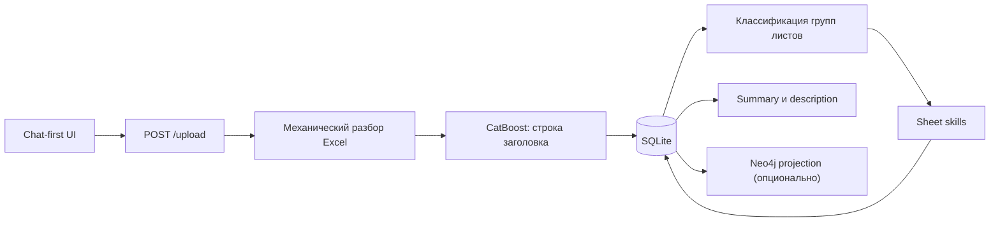
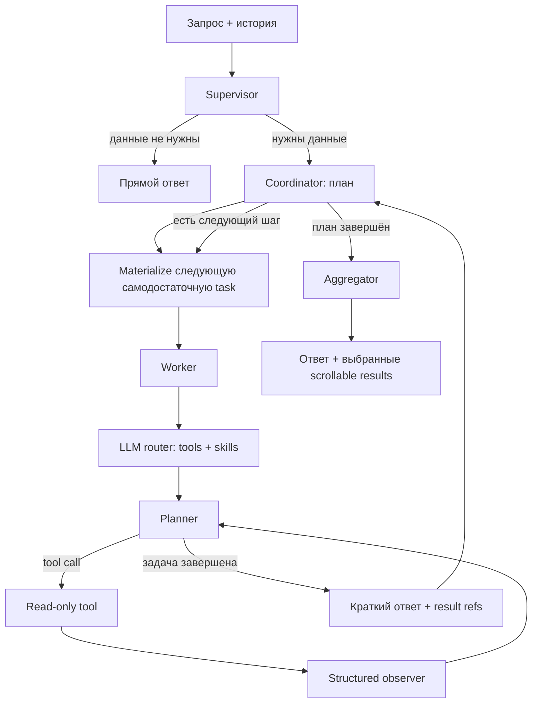

# ETL S2T Agent

[](https://www.python.org/)
[](https://flask.palletsprojects.com/)
[](https://www.langchain.com/langgraph)

ETL S2T Agent — chat-first приложение для загрузки и анализа Excel-файлов с Source-to-Target-маппингами. Оно сохраняет исходные факты в SQLite, извлекает S2T- и SQL-lineage, при наличии Neo4j строит графовую проекцию и отвечает на вопросы через многоагентный LangGraph.

## Возможности

- загрузка `.xlsx`, `.xls` и `.xlsm` из единого интерфейса чата;
- автоматический выбор строки заголовка CatBoost-моделью;
- сохранение заголовков и значений Excel без обрезки в SQLite;
- классификация листов и настраиваемое сопоставление колонок;
- извлечение S2T, каталогов таблиц, PXF-маппингов и дополнительных объектов;
- разбор SQL дополнительных объектов через SQLGlot;
- read-only вопросы к SQLite и Neo4j на естественном языке;
- полные табличные результаты в отдельном scrollable-блоке, а не в тексте чата;
- сравнение многоагентного режима с базовым одноагентным режимом;
- метрики времени, LLM-вызовов, инструментов и токенов для live-сценариев.

## Архитектура

SQLite является источником исходных фактов. Neo4j хранит только производную проекцию lineage и может быть отключён.

### Загрузка Excel



`processing/excel.py` читает каждый лист один раз, сохраняет исходные номера строк, разворачивает объединённые ячейки данных и по умолчанию исключает скрытые строки. Включить их можно при загрузке в интерфейсе.

Строка заголовка выбирается среди первых десяти строк моделью из `models/catboost_header_model.cbm`. Кандидаты с тремя и более пустыми/`Untitled` значениями исключаются, если остаются менее разреженные строки. При ошибке CatBoost используется настроенный LLM-provider.

После механического разбора:

1. лист сопоставляется с группой из `config/sheet_groups.json`;
2. колонки сначала сопоставляются детерминированно по `config/column_mapping.json`;
3. LLM вызывается только для листа с неполным сопоставлением;
4. результат валидируется и транзакционно записывается в целевую таблицу.

Одинаковые строки Excel не дедуплицируются. Если в непустой S2T-строке отсутствует `target_table`, запись завершается явной ошибкой до начала транзакции. Строки без единого S2T-значения не считаются бизнес-строками.

### Многоагентный чат

По умолчанию `CHAT_AGENT_MODE=multiagent`.



Основные контракты:

- supervisor отдельно формирует исполнимую `task` и устойчивый `context`;
- неявного «активного файла» нет: файл берётся только из запроса, однозначной ссылки в истории или результата `list_files`/`resolve_file`;
- coordinator создаёт семантический план и последовательно материализует зависимые подзадачи;
- worker получает только самодостаточную строку задачи, внутри сам выбирает tools и runtime skills;
- planner видит исходную задачу, последний обмен с инструментом и накопительную observer-выжимку;
- observer возвращает structured-поля `goal_satisfied`, `mismatches`, факты, ограничения и запрос на reroute;
- полные результаты инструментов не копируются в историю worker: там остаётся ограниченный preview;
- coordinator получает краткий ответ worker и непрозрачные ссылки на полные результаты;
- табличные результаты SQLite-tools дополнительно материализуются во временной базе одного coordinator-запуска; зависимый worker получает `result_ref` и схему relation `result`, после чего может выполнить по ней read-only SQL через `query_saved_result`;
- если tool вернул только preview, схема сохранённого результата содержит `truncated=true`, поэтому его нельзя использовать как полный исходный набор;
- aggregator видит только общий context, краткие ответы и каталог ссылок, после чего выбирает результаты для UI;
- полные данные разрешаются по ссылкам только на границе HTTP-ответа.

Worker завершается самим planner через `finish_worker(answer)` или обычным финальным текстом. Отдельного responder и дополнительного LLM-аудита завершения в worker-цикле нет.

Режим `single_agent` сохранён как базовая линия для live-сравнений:

```ini
CHAT_AGENT_MODE=single_agent
```

## Хранилище

По умолчанию SQLite создаётся в `excel_data.db`.

| Таблица | Назначение |
|---|---|
| `files` | загрузки, summary и description |
| `file_sheet_headers` | решения по заголовкам и плоские имена колонок |
| `data` | исходные значения Excel с `file_id`, листом, строкой и колонкой |
| `source_tables` | построчный каталог таблиц-источников |
| `target_tables` | построчный каталог целевых таблиц |
| `source_columns` | колонки источников: заголовки определяются по aliases из `column_mapping.json` и, если ролей не хватает, одной LLM-проверкой; хранятся тип, PK, not-null, описание и embedding из технического имени плюс описания; специализированный лист дополняется сырым S2T |
| `target_columns` | целевые колонки: заголовки определяются по aliases из `column_mapping.json` и, если ролей не хватает, одной LLM-проверкой; хранятся тип, PK, not-null, описание и embedding из технического имени плюс описания; специализированный лист дополняется сырым S2T |
| `additional_objects` | имя и полный SQL дополнительного объекта |
| `pxf_to_a` | внешняя, материализованная и репличная таблицы, СОД |
| `s2t_transformations` | общая таблица колонковых ETL-связей и правил |

Если на специализированном листе колонок отсутствует имя таблицы, оно
подставляется только при однозначном совпадении `column_name` на сыром S2T-листе.
Имя предыдущей строки не наследуется, а неоднозначность остаётся явной в отчёте.

`s2t_transformations` содержит как строки исходных S2T-листов, так и связи, извлечённые из `additional_objects.sql`. Для дополнительных объектов SQLGlot обрабатывает CTE, вложенные SELECT и set-операции; ошибки одного объекта попадают в отчёт и не останавливают остальные.

`source_layer` и `target_layer` определяются по группе листа правилами из `config/table_layers.json`, а не по имени таблицы и не через LLM.

### Neo4j

При настроенном подключении `services/graph_sync.py` пересобирает проекцию одного файла:

- `ETLColumn` и `TRANSFORMS_TO` — lineage колонок;
- `ETLTable` и `TABLE_TRANSFORMS_TO` — lineage таблиц.

Если Neo4j выключен или недоступен, SQLite-анализ сохраняется, а ошибка синхронизации возвращается отдельно. Для вопросов по S2T и трансформациям используется SQLite; Neo4j предназначен для путей и lineage.

## Быстрый запуск

Требования:

- Python 3.12+;
- [uv](https://docs.astral.sh/uv/);
- GigaChat, OpenRouter или локальный Ollama;
- Neo4j 5+ — только для графовых сценариев.

```bash
git clone https://github.com/Xpehutta/ETL-S2T-Parser.git
cd ETL-S2T-Parser
uv sync
```

Скопируйте `.env.example` в `.env`, заполните выбранный provider и запустите:

```bash
uv run python app.py
```

Интерфейс будет доступен на `http://127.0.0.1:5000`. Пути `/` и `/chat_app` открывают один и тот же chat-first экран с загрузкой файла, прогрессом анализа, чатом и просмотром полной таблицы трансформаций.

## Настройка LLM

По умолчанию используется GigaChat.

### GigaChat

```ini
LLM_PROVIDER=gigachat
GIGACHAT_API_KEY=your_key
GIGACHAT_MODEL=GigaChat
GIGACHAT_API_URL=https://gigachat.devices.sberbank.ru/api/v1
GIGACHAT_SCOPE=GIGACHAT_API_PERS
GIGACHAT_VERIFY_SSL=false
GIGACHAT_TIMEOUT=120
```

Вместо `GIGACHAT_API_KEY` поддерживаются `GIGACHAT_CREDENTIALS` и `GIGACHAT_EMBEDDINGS_CREDENTIALS`.

### Ollama

Модель должна поддерживать native tool calling и structured output.

```bash
ollama pull qwen3.5:9b
```

```ini
LLM_PROVIDER=ollama
OLLAMA_MODEL=qwen3.5:9b
OLLAMA_BASE_URL=http://localhost:11434
OLLAMA_NUM_CTX=16384
OLLAMA_TIMEOUT=120
OLLAMA_TEMPERATURE=0
OLLAMA_REASONING=false
```

### OpenRouter

```ini
LLM_PROVIDER=openrouter
OPENROUTER_API_KEY=your_key
OPENROUTER_MODEL=openrouter/free
OPENROUTER_BASE_URL=https://openrouter.ai/api/v1
OPENROUTER_TIMEOUT=120
OPENROUTER_TEMPERATURE=0
```

### Neo4j

```ini
NEO4J_URI=neo4j://localhost:7687
NEO4J_USERNAME=neo4j
NEO4J_PASSWORD=change_me
NEO4J_DATABASE=neo4j
```

## Конфигурация извлечения

| Файл | Назначение |
|---|---|
| `config/sheet_groups.json` | группы листов и их алиасы |
| `config/column_mapping.json` | роли и варианты названий Excel-колонок |
| `config/usefull_col_extraction.json` | группа листа, целевая SQLite-таблица и поля |
| `config/table_layers.json` | переходы ETL-слоёв по группам листов |

Новые подтверждённые алиасы листов и заголовков добавляются в текущие JSON-конфигурации без дублей.

## HTTP API

| Метод | Путь | Назначение |
|---|---|---|
| `GET` | `/`, `/chat_app` | chat-first UI |
| `POST` | `/upload` | загрузка и полный анализ Excel |
| `GET` | `/analysis_progress/<upload_id>` | прогресс загрузки |
| `POST` | `/chat` | запрос к выбранному агентному режиму |
| `GET` | `/summary/<file_id>` | summary файла |
| `GET` | `/description/<file_id>` | краткое описание файла |
| `GET` | `/transformations` | глобальная таблица S2T |
| `GET` | `/transformations/<file_id>` | S2T указанного файла |
| `DELETE` | `/transformations/<file_id>` | явная очистка S2T файла |
| `DELETE` | `/storage` | явная полная очистка хранилищ |
| `GET` | `/sheet_groups/<file_id>/classify` | классификация листов |
| `GET` | `/exports/...` | скачивание полных результатов |

История чата хранится в `sessionStorage` браузера и передаётся в `/chat`. В SQLite история не записывается.

## Тесты

Обычный набор не обращается к реальной модели:

```bash
pytest tests/ -q
pytest tests/ --cov=. --cov-config=.coveragerc
```

### Live-сценарии

Live-тесты используют реальный Flask `/chat`, текущую `excel_data.db`, выбранный provider и запущенный Neo4j для графовых сценариев. Supervisor, coordinator, workers, router, tools, observer и aggregator не подменяются. Запросы выполняются строго последовательно, без batching и параллельного pytest.

```powershell
$env:RUN_LIVE_AGENT_SCENARIOS = "1"
$env:LIVE_AGENT_MODE = "multiagent"
$env:LLM_PROVIDER = "ollama"
$env:OLLAMA_MODEL = "qwen3.5:9b"
$env:LIVE_AGENT_TRANSCRIPT_PATH = ".test_runs/live-agent.md"
pytest tests/test_live_agent_scenarios.py -q
```

Десять сценариев проверяют обычный диалог, SQLite-count, ссылку на историю, scrollable-результаты, зависимые workers, точные S2T-пары, Neo4j-пути и переход SQLite → Neo4j. Помимо правильности ответа проверяются необходимые tools/displays, время, число LLM-вызовов и токены.

Для последовательного сравнения режимов:

```bash
uv run python scripts/run_live_agent_benchmark.py \
  --provider ollama \
  --model qwen3.5:9b \
  --modes multiagent single_agent
```

Отчёты записываются в `.test_runs/` и не попадают в git.

## Структура проекта

```text
app.py                         Flask API и выбор режима чата
processing/excel.py            механический разбор Excel
storage/database.py            схема и хранение исходных данных
storage/s2t.py                 операции с S2T transformations
sheet_skills/                  обработчики групп Excel-листов
services/analysis.py           post-upload pipeline
services/graph_sync.py         проекция SQLite → Neo4j
graph_storage/                 lifecycle и настройки Neo4j
agents/supervisor.py           верхний LangGraph
agents/coordinator.py          план и агрегация workers
agents/worker.py               изолированный worker runtime
agents/chat_graph.py           planner/tool/observer loop
agents/tools/routing.py        LLM router tools и skills
agents/tools/                  read-only/write registries и tools
agents/prompts/                runtime prompts и skills
agents/run_metrics.py          метрики live-запусков
config/                        JSON-конфигурации извлечения
templates/chat_app.html        единый интерфейс
scripts/                       benchmark-скрипты
tests/                         unit, integration и live tests
samples/                       примеры S2T Excel
```

## Логи и трассировка

Логи пишутся в консоль и в ротационный UTF-8 файл `logs/agent.log`. Уровень и размер задаются через `LOG_LEVEL`, `LOG_FILE`, `LOG_MAX_BYTES` и `LOG_BACKUP_COUNT`.

Langfuse необязателен. Для включения задайте `LANGFUSE_ENABLED=true`, `LANGFUSE_PUBLIC_KEY` и `LANGFUSE_SECRET_KEY`.

## Безопасность данных

- чат read-only по умолчанию;
- mutation-tools находятся в отдельном registry;
- очистка и повторная запись требуют явного действия пользователя;
- свободный SQL и Cypher ограничены read-only операциями;
- полные tool results не размножаются в LLM-контексте;
- SQLite остаётся источником истины даже при включённом Neo4j.
