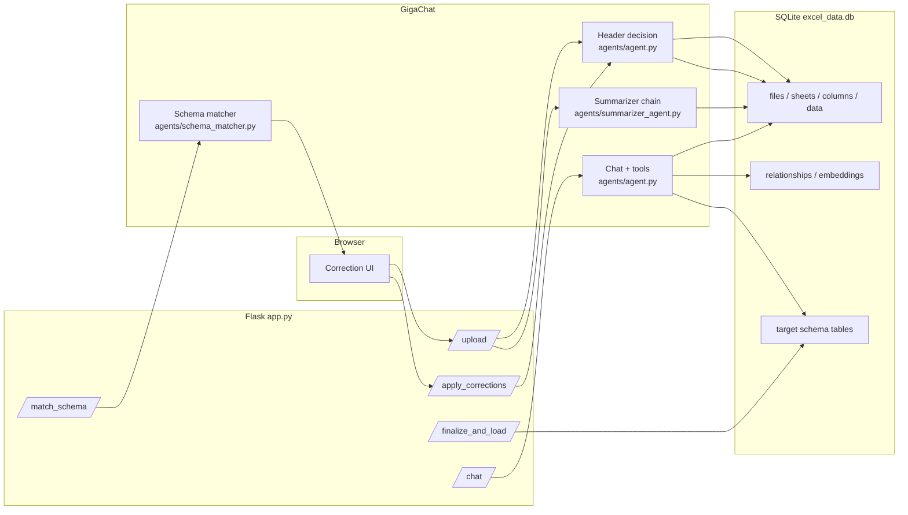
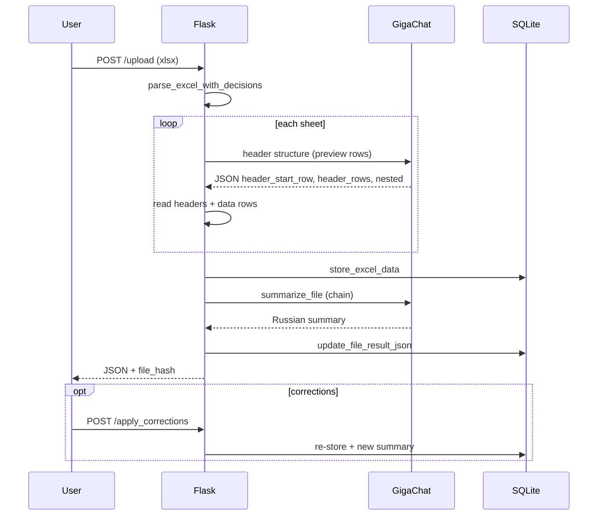
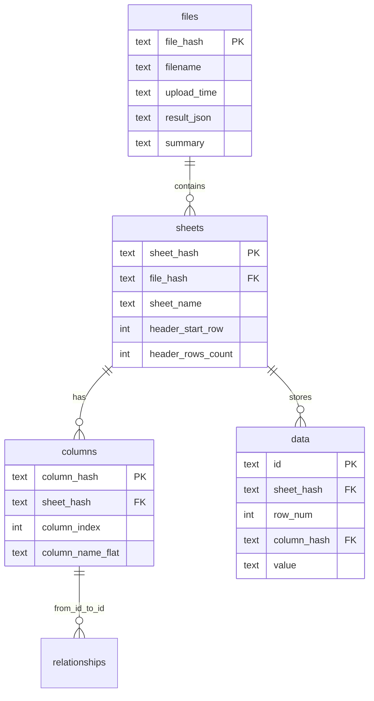
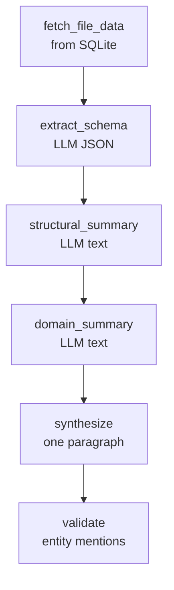

# ETL S2T Parser – AI-Powered Excel Metadata Extractor

[](https://www.python.org/downloads/)
[](https://flask.palletsprojects.com/)
[](LICENSE)

**ETL S2T Parser** helps analysts work with messy Excel files that describe Source-to-Target (S2T) mappings, ETL rules, and data dictionaries. It uses **GigaChat** to infer where column headers start (including merged cells and multi-level headers), exposes a **Flask** web UI for corrections, persists structure and sample rows in **SQLite**, and can **match** sheets to a target schema and **load** mappings into graph-friendly tables. A multi-step pipeline also generates a **Russian business summary** of each upload.

---

## What the system does

1. **Parse** each sheet: preview rows, detect empty sheets, ask the LLM for header row span (or apply user overrides).
2. **Normalize** headers into flat names (for example `Parent > Child`) and store up to thousands of data cells per sheet.
3. **Summarize** the file in Russian using several LLM calls (structure, domain, final synthesis).
4. **Optional:** run **schema matching** against a built-in target model and **finalize** high-confidence rows into `source_tables`, `target_tables`, `column_mappings`, and `additions`.
5. **Optional:** **semantic search** over stored embeddings (`semantic_layer`) and a **chat** endpoint that runs a small ReAct-style tool loop (`agent_chat`).

The diagram below shows the main runtime path from upload to storage.



---

## Architecture (modules)

| Module | Role |
|--------|------|
| `app.py` | Flask app: upload, corrections, preview, summary, schema match, finalize, chat. |
| `agents/agent.py` | `get_header_decision()` (LLM + heuristics); `agent_chat()` (tool-calling loop). |
| `agents/summarizer_agent.py` | LCEL chain: fetch DB snapshot → extract schema → structural/domain text → synthesize → validate. |
| `agents/schema_matcher.py` | LangChain Runnable chains: sheet→table match, column mapping; `compare_with_target()`. |
| `db_storage.py` | SQLite schema, migrations, `store_excel_data`, graph helpers, embedding table. |
| `data_loader.py` | `load_data_from_similarity_report()` → target tables + `MAPS_TO` edges. |
| `semantic_layer.py` | GigaChat embeddings, `similarity_search`, `store_embedding`. |
| `load_skills_tools.py` | Loads `skills.md` / `tools.md`; registers SQL/lineage/list/similarity tools for the chat agent. |
| `templates/index.html` | Upload and per-sheet correction UI. |

**Design note:** Header detection is **not** LangGraph in the current codebase; the README previously mentioned LangGraph generically—`agents/schema_matcher.py` and other parts use LangChain Runnables. Optional **Langfuse** tracing is wired where `observe` decorators exist.

---

## End-to-end upload sequence



---

## Data model (conceptual)

Files are keyed by **`file_hash`** (MD5 of raw file bytes). Each non-skipped sheet gets a deterministic **`sheet_hash`**. Columns and cell values reference `sheet_hash`.



**Target-side tables** (`source_tables`, `target_tables`, `column_mappings`, `additions`) hold normalized mapping metadata. **`relationships`** stores lineage edges (for example column → mapping).

---

## Summarizer pipeline



---

## Chat agent and tools

`/chat` runs **`agent_chat`**: the model is prompted to emit `Thought` / `Action` / `Action Input: { ... }` lines. The server parses JSON with a balanced decoder (nested objects supported), executes a function from `load_skills_tools.TOOL_FUNCTIONS`, and appends an `Observation` until the model answers or the step limit is reached.

Registered tools include `run_sql`, `mapping_overview` (counts + samples for finalized S2T tables), `list_files`, `list_sheets`, `list_columns`, lineage helpers, and `similarity_search` (requires embedding API credentials and populated `embeddings` table).

---

## Installation

### Prerequisites

- Python **3.12+**
- **uv** (recommended) or **pip**
- **GigaChat** API access

### Clone and install

```bash
git clone https://github.com/Xpehutta/ETL-S2T-Parser.git
cd ETL-S2T-Parser
uv sync
# or: pip install -e .
```

### Run

```bash
uv run python app.py
# or: make run

# Optional: Streamlit workspace for grounded S2T insights (uses same SQLite + GigaChat)
uv run streamlit run streamlit_insights.py
# or: make streamlit-insights
```

Open **http://127.0.0.1:5000**.

---

## Configuration

Create a **`.env`** in the project root (never commit secrets):

```ini
# Required for LLM calls (agent, summarizer, schema matcher, header decision)
GIGACHAT_API_KEY=your_key
GIGACHAT_API_URL=https://gigachat.devices.sberbank.ru/api/v1
GIGACHAT_VERIFY_SSL=false
GIGACHAT_SCOPE=GIGACHAT_API_PERS
MODEL=GigaChat-Pro
GIGACHAT_TIMEOUT=120
```

**Embeddings** (`semantic_layer.py`, used by similarity tools) also read `GIGACHAT_API_KEY` or `GIGACHAT_EMBEDDINGS_CREDENTIALS`. If embeddings are not used, you still need chat credentials to start imports that load `semantic_layer` indirectly (for example via tool imports in some code paths).

| Variable | Purpose |
|----------|---------|
| `GIGACHAT_API_KEY` | Primary credential for GigaChat |
| `GIGACHAT_EMBEDDINGS_CREDENTIALS` | Alternative credential label for embeddings |
| `GIGACHAT_API_URL` | API base URL |
| `GIGACHAT_VERIFY_SSL` | `true` / `false` |
| `GIGACHAT_SCOPE` | OAuth scope |
| `MODEL` | Chat model id |
| `GIGACHAT_TIMEOUT` | HTTP timeout (seconds) |

Optional **Langfuse** tracing: install `langfuse` and configure `langfuse_setup.py` / environment as in your deployment.

---

## API reference

| Method | Path | Body / params | Description |
|--------|------|----------------|-------------|
| `GET` | `/` | — | Web UI |
| `POST` | `/upload` | `multipart/form-data` file | Parse Excel, store DB rows, return JSON + `file_hash` |
| `POST` | `/apply_corrections` | JSON: `file_hash`, `corrections[]` | Re-parse with overrides; file bytes must still be in server cache |
| `POST` | `/preview_headers` | JSON: `file_hash`, `sheet_name`, `option` | Header preview for UI |
| `GET` | `/summary/<file_hash>` | — | Stored or on-demand summary |
| `POST` | `/match_schema` | JSON: same shape as `/upload` response | LLM sheet/table + column mapping report |
| `POST` | `/finalize_and_load` | JSON: `file_hash`, optional `similarity_report` | Load mappings into target tables |
| `POST` | `/chat` | JSON: `query` | Tool-using agent answer |

**Upload response (conceptual):** `filename`, `model_used`, `file_hash`, `summary`, `sheets[]` with `ai_decision`, `columns`, previews, and `skipped` / `skip_reason` where applicable.

---

## Web workflow

1. **Upload** an `.xlsx` / `.xls` / `.xlsm` file.
2. Review per-sheet **AI header** choices and data preview.
3. Adjust options or skip sheets; **preview headers** updates live.
4. **Apply corrections** to refresh the DB and summary.
5. Optionally run **schema match** and **finalize** from the UI/API when integrated.

---

## Database files

- Default path: **`excel_data.db`** in the working directory (configurable in code via `db_storage.DB_PATH`).
- Tables: `files`, `sheets`, `columns`, `data`, `relationships`, `embeddings`, plus target schema tables listed above.

---

## Tests

```bash
export GIGACHAT_API_KEY=dummy   # required for imports that load GigaChat clients
pytest tests/ -q
# or: make test
```

Coverage:

```bash
make test-cov
```

---

## Project layout (short)

```
├── app.py                 # Flask entrypoint
├── agents/
│   ├── agent.py           # Header LLM + chat agent
│   ├── summarizer_agent.py
│   └── schema_matcher.py
├── data_loader.py         # Load from similarity report
├── db_storage.py          # SQLite layer
├── semantic_layer.py      # Embeddings + similarity
├── load_skills_tools.py   # skills/tools markdown + tool registry
├── skills.md / tools.md   # Prompt and tool documentation
├── templates/index.html
├── tests/
└── pyproject.toml         # Dependencies
```

---

## Acknowledgements

- [GigaChat](https://developers.sber.ru/portal/products/gigachat) for LLM APIs  
- [LangChain](https://www.langchain.com/) / LangGraph ecosystem used in schema and summarizer code paths  
- [Flask](https://flask.palletsprojects.com/) for the web layer  
- [pandas](https://pandas.pydata.org/) / [openpyxl](https://openpyxl.readthedocs.io/) for Excel I/O  
