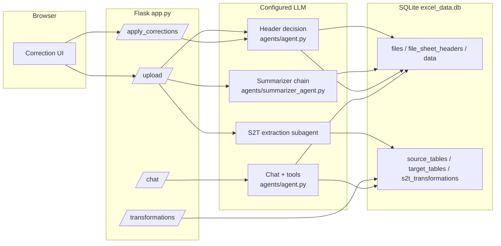
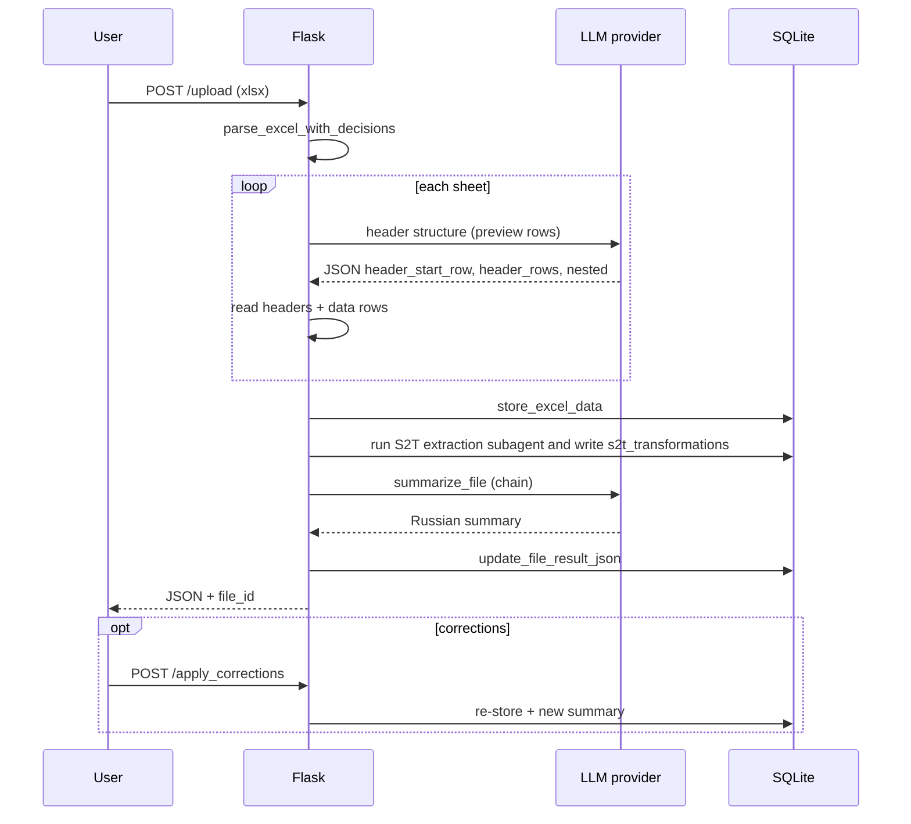
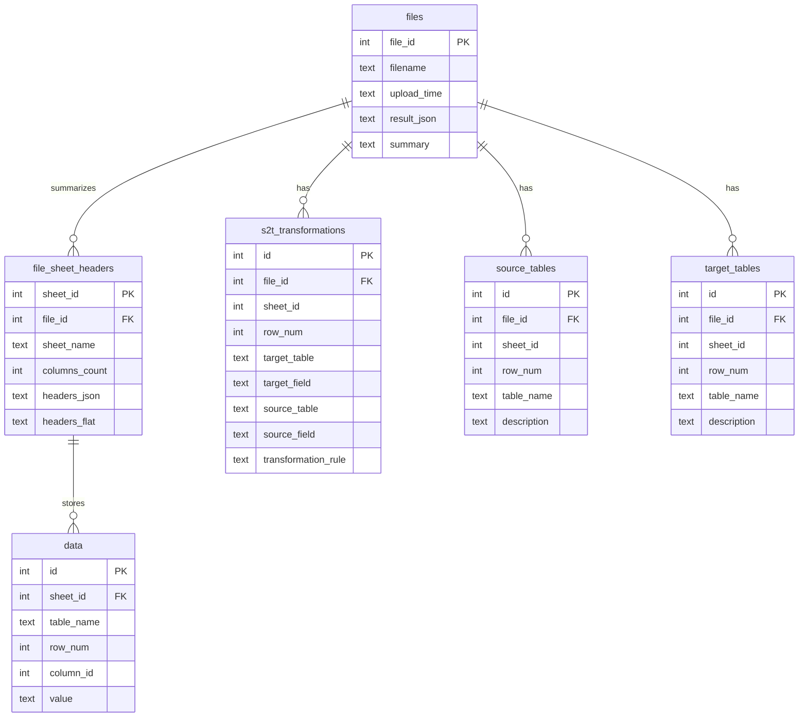
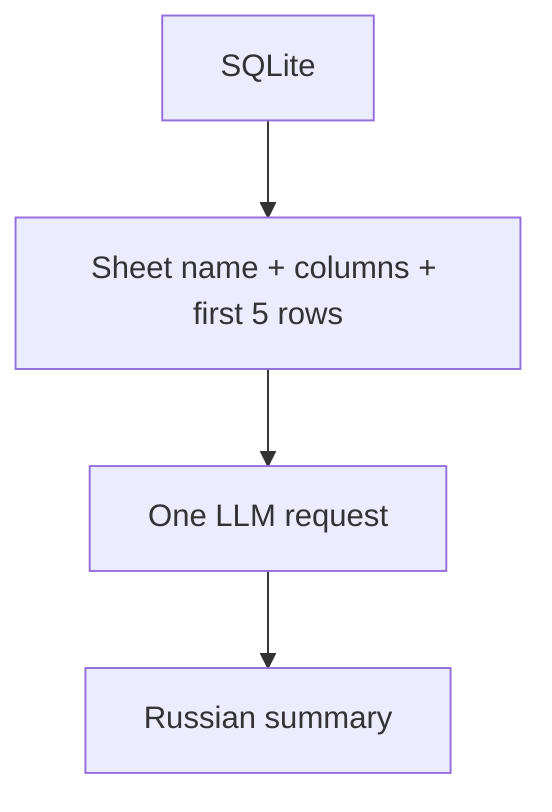

# ETL S2T Parser – AI-Powered Excel Metadata Extractor

[](https://www.python.org/downloads/)
[](https://flask.palletsprojects.com/)
[](LICENSE)

**ETL S2T Parser** helps analysts work with messy Excel files that describe Source-to-Target (S2T) mappings, ETL rules, and data dictionaries. It uses a configured **LLM provider** (GigaChat, OpenRouter, or Ollama) to infer where column headers start (including merged cells and multi-level headers), exposes a **Flask** web UI for corrections, persists workbook structure and sample rows in **SQLite**, extracts minimal S2T transformations through an internal subagent, and answers questions through a small tool-using chat loop. A one-pass summarizer can also generate a **Russian business summary** of each upload.

---

## What the system does

1. **Parse** each sheet: preview rows, detect empty sheets, ask the LLM for header row span (or apply user overrides).
2. **Normalize** headers into flat names (for example `Parent > Child`) and store up to thousands of data cells per sheet.
3. **Summarize** the file in Russian using several LLM calls (structure, domain, final synthesis).
4. **Extract table catalogs and S2T transformations** from the configured `source_tables`, `target_tables`, and `s2t` sheet groups.
5. **Answer questions** through `/chat` using current tools over files, saved sheet headers, row values, and S2T transformations.

The diagram below shows the main runtime path from upload to storage.



---

## Architecture (modules)

| Module | Role |
|--------|------|
| `app.py` | Thin Flask routes: upload, corrections, preview, summary, S2T extraction, transformations API, chat. |
| `processing/excel.py` | Mechanical workbook parsing: preview, existing header detection, stored columns, and raw rows. |
| `agents/agent.py` | `get_header_decision()` (LLM + heuristics); входная точка `agent_chat()`. |
| `agents/chat_graph.py` | LangGraph planner with native tool calling, `ToolNode`, structured observer, and responder. |
| `agents/summarizer_agent.py` | One-pass summary from column names and the first five stored rows of every sheet. |
| `sheet_skills/s2t.py` | S2T sheet skill: inspect, deterministic/LLM column matching, validate rows, build records. |
| `sheet_skills/table_catalog.py` | Source/target table-catalog sheet skill without business-value deduplication. |
| `storage/s2t.py` | Transactional persistence, reads, search/aggregation, clear, and verification. |
| `storage/database.py` | Current SQLite schema, migrations, generic workbook metadata and raw-row storage. |
| `config/` | JSON configuration and typed loaders for sheet groups and column mappings. |
| `agents/tools/` | Decorated `@tool` modules split by domain plus explicit read-only/write registries. |
| `templates/index.html` | Upload and per-sheet correction UI. |

**Design note:** Header detection uses a LangChain-style LLM call. Chat orchestration uses a multi-step LangGraph with application-controlled tool execution; S2T extraction is implemented as an internal subagent. Optional **Langfuse** tracing is wired where `observe` decorators exist.

---

## End-to-end upload sequence



---

## Data model (conceptual)

Every upload receives a new numeric **`file_id`**. Each parsed sheet receives a numeric **`sheet_id`**, and columns are referenced inside a sheet by a 1-based numeric **`column_id`**. Identical uploaded files and identical extracted rows remain separate records.



**`file_sheet_headers`** stores one row per uploaded sheet with saved headers. **`data`** is the public row-value table for inspecting workbook contents. **`source_tables`** and **`target_tables`** store table names and descriptions from their configured sheet groups. **`s2t_transformations`** stores row-level transformations from the parsed `s2t` sheet. Equal source rows are retained as separate records in all three extracted tables. The user-facing schema contains `files`, `file_sheet_headers`, `source_tables`, `target_tables`, `s2t_transformations`, and `data`.

---

## Summarizer pipeline



---

## Chat agent and tools

`/chat` runs **`agent_chat`** through a LangGraph state graph. The planner uses native model tool calls and invokes one registered read-only `BaseTool` through `ToolNode`. A structured observer extracts facts and limitations from each real `ToolMessage`; the planner then decides whether another tool is needed. A separate responder produces the final user-facing answer when the planner stops calling tools.

The chat page keeps successful `user` / `assistant` turns in browser `sessionStorage`, restores them after a reload in the same tab, and sends only the latest bounded context to `/chat`. Chat history is not persisted in SQLite or a server-side session.

Registered tools include `run_sql`, `list_files`, `list_sheets`, `list_columns`, `list_file_sheet_headers`, `list_s2t_transformations`, `search_s2t_transformations`, and `list_sheet_group_classifications`.

---

## Installation

### Prerequisites

- Python **3.12+**
- **uv** (recommended) or **pip**
- **GigaChat**, **OpenRouter**, or local **Ollama** access

### Clone and install

```bash
git clone https://github.com/Xpehutta/ETL-S2T-Parser.git
cd ETL-S2T-Parser
uv sync
# or: pip install -e .
```

### Run

```bash
uv run python app.py
# or: make run

```

Open **http://127.0.0.1:5000**.

---

## Configuration

Create a **`.env`** in the project root (never commit secrets).

OpenRouter free-router setup:

```ini
LLM_PROVIDER=openrouter
OPENROUTER_API_KEY=sk-or-v1-...
OPENROUTER_MODEL=openrouter/free
OPENROUTER_BASE_URL=https://openrouter.ai/api/v1
OPENROUTER_TIMEOUT=120
OPENROUTER_TEMPERATURE=0
```

Ollama local setup:

```bash
ollama pull qwen2.5:7b
```

```ini
LLM_PROVIDER=ollama
OLLAMA_MODEL=qwen2.5:7b
OLLAMA_BASE_URL=http://localhost:11434/v1
OLLAMA_NUM_CTX=16384
OLLAMA_TIMEOUT=120
OLLAMA_TEMPERATURE=0
OLLAMA_REASONING=false
```

GigaChat setup:

```ini
# Required for GigaChat-backed LLM calls (agent, summarizer, header decision)
LLM_PROVIDER=gigachat
GIGACHAT_API_KEY=your_key
GIGACHAT_API_URL=https://gigachat.devices.sberbank.ru/api/v1
GIGACHAT_VERIFY_SSL=false
GIGACHAT_SCOPE=GIGACHAT_API_PERS
MODEL=GigaChat
GIGACHAT_TIMEOUT=120
GIGACHAT_HEADER_TIMEOUT=20
GIGACHAT_HEADER_RETRY_ATTEMPTS=1
GIGACHAT_HEADER_PREVIEW_ROWS=4
```

Optional isolated Neo4j connection module:

```ini
NEO4J_URI=neo4j://localhost:7687
NEO4J_USERNAME=neo4j
NEO4J_PASSWORD=change_me
NEO4J_DATABASE=neo4j
```

The `graph_storage` package owns only Neo4j configuration and driver lifecycle.
After SQLite analysis is committed, `services/graph_sync.py` rebuilds the
selected file's column-lineage projection. Neo4j stores only `ETLColumn` nodes
and `TRANSFORMS_TO` relationships; all other facts remain in SQLite.

The current chat tools do not require the removed legacy embeddings table.

| Variable | Purpose |
|----------|---------|
| `LLM_PROVIDER` | `gigachat`, `openrouter`, or `ollama` |
| `OPENROUTER_API_KEY` | OpenRouter API key |
| `OPENROUTER_MODEL` | OpenRouter model id; `openrouter/free` uses the free-model router |
| `OPENROUTER_BASE_URL` | OpenRouter OpenAI-compatible API base URL |
| `OPENROUTER_TIMEOUT` | OpenRouter HTTP timeout (seconds) |
| `OPENROUTER_TEMPERATURE` | OpenRouter sampling temperature |
| `OLLAMA_MODEL` | Local Ollama model id, for example `qwen2.5:7b` |
| `OLLAMA_BASE_URL` | Ollama OpenAI-compatible API base URL, usually `http://localhost:11434/v1` |
| `OLLAMA_NUM_CTX` | Optional Ollama context window size in tokens, for example `16384` |
| `OLLAMA_TIMEOUT` | Ollama HTTP timeout (seconds) |
| `OLLAMA_TEMPERATURE` | Ollama sampling temperature |
| `OLLAMA_REASONING` | Enable or disable Ollama thinking; keep `false` for the chat graph |
| `OLLAMA_MAX_TOKENS` | Optional max token cap for Ollama responses |
| `GIGACHAT_API_KEY` | Primary credential for GigaChat |
| `GIGACHAT_EMBEDDINGS_CREDENTIALS` | Alternative credential label for embeddings |
| `GIGACHAT_API_URL` | API base URL |
| `GIGACHAT_VERIFY_SSL` | `true` / `false` |
| `GIGACHAT_SCOPE` | OAuth scope |
| `MODEL` | Chat model id; use `GigaChat` by default, switch to `GigaChat-Pro` only when the API key/tariff allows it |
| `GIGACHAT_TIMEOUT` | HTTP timeout (seconds) |
| `GIGACHAT_HEADER_TIMEOUT` | Short timeout for header detection calls |
| `GIGACHAT_HEADER_RETRY_ATTEMPTS` | Retry attempts for header detection |
| `GIGACHAT_HEADER_PREVIEW_ROWS` | Number of top rows sent to header detection |

Optional **Langfuse** tracing: install `langfuse` and configure `agents/observability.py` / environment as in your deployment.

---

## API reference

| Method | Path | Body / params | Description |
|--------|------|----------------|-------------|
| `GET` | `/` | — | Web UI |
| `GET` | `/chat_app` | — | Single-user chat-first UI |
| `POST` | `/upload` | `multipart/form-data` file | Parse Excel, store DB rows, return JSON + `file_id` |
| `POST` | `/apply_corrections` | JSON: `file_id`, `corrections[]` | Re-parse with overrides; file bytes must still be in server cache |
| `POST` | `/preview_headers` | JSON: `file_id`, `sheet_name`, `option` | Header preview for UI |
| `GET` | `/summary/<file_id>` | — | Stored or on-demand summary |
| `GET` | `/transformations/<file_id>` | query: `limit`, `q` | Browse extracted `s2t_transformations` rows |
| `POST` | `/transformations/<file_id>/refresh` | — | Re-run S2T extraction subagent |
| `DELETE` | `/transformations/<file_id>` | — | Clear S2T transformations for a file |
| `DELETE` | `/storage` | — | Clear all SQLite data, the Neo4j projection, and runtime upload caches |
| `GET` | `/sheet_groups/<file_id>/classify` | query: `llm=0/1` | Classify sheet groups |
| `POST` | `/chat` | JSON: `query` | Tool-using agent answer |

**Upload response (conceptual):** `filename`, `model_used`, `file_id`, `summary`, and `sheets[]` with `header`, `columns`, `data_preview`, and an optional `skip_reason`.

---

## Web workflow

1. **Upload** an `.xlsx` / `.xls` / `.xlsm` file.
2. Review per-sheet **AI header** choices and data preview.
3. Adjust options or skip sheets; **preview headers** updates live.
4. **Apply corrections** to refresh the DB and summary.
5. Browse or refresh extracted **S2T transformations**.

---

## Database files

- Default path: **`excel_data.db`** in the working directory (configurable in code via `storage.database.DB_PATH`).
- Physical/user-facing tables: `files`, `file_sheet_headers`, `source_tables`, `target_tables`, `s2t_transformations`, `data`.
- Legacy catalog/lineage tables are dropped by `init_db`: `relationships`, `embeddings`, `column_mappings`, `additions`.

---

## Tests

```bash
export GIGACHAT_API_KEY=dummy   # required for imports that load GigaChat clients
pytest tests/ -q
# or: make test
```

Coverage:

```bash
make test-cov
```

---

## Project layout (short)

```
├── app.py                 # Flask entrypoint
├── processing/
│   └── excel.py           # Mechanical Excel parsing
├── storage/
│   ├── database.py        # SQLite schema and workbook persistence
│   └── s2t.py             # S2T repository
├── graph_storage/
│   ├── config.py          # Isolated Neo4j environment settings
│   └── connection.py      # Driver lifecycle without graph queries
├── services/
│   └── graph_sync.py      # SQLite-to-Neo4j file projection
├── config/
│   ├── column_mapping.py
│   ├── sheet_groups.py
│   ├── useful_columns.py
│   └── *.json
├── agents/
│   ├── agent.py           # Header LLM + chat agent
│   ├── tools/
│   │   ├── sql.py         # Read-only SQL tool
│   │   ├── files.py       # File metadata tools
│   │   ├── s2t.py         # S2T query tools
│   │   ├── sheets.py      # Sheet/header tools
│   │   └── registry.py    # Read-only/write registries
│   ├── observability.py   # Optional Langfuse integration
│   ├── summarizer_agent.py
│   ├── sheet_group_classifier.py
│   └── prompts/
├── sheet_skills/
│   ├── s2t.py
│   └── table_catalog.py
├── samples/               # Example S2T workbooks
├── templates/index.html
├── tests/
└── pyproject.toml         # Dependencies
```

---

## Acknowledgements

- [GigaChat](https://developers.sber.ru/portal/products/gigachat), [OpenRouter](https://openrouter.ai/docs), and [Ollama](https://ollama.com/) for LLM APIs
- [LangChain](https://www.langchain.com/) / LangGraph ecosystem used in schema and summarizer code paths  
- [Flask](https://flask.palletsprojects.com/) for the web layer  
- [pandas](https://pandas.pydata.org/) / [openpyxl](https://openpyxl.readthedocs.io/) for Excel I/O  
